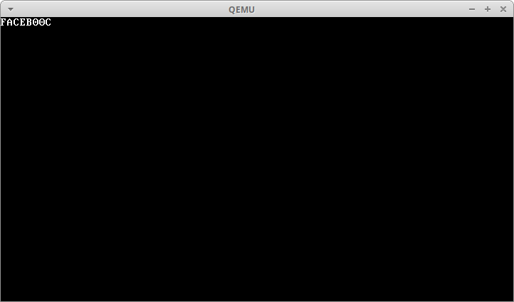

# BI-SOJ 2014/15

## Úloha 1.A

### Zadání

Pripravte si podprogram, ktery bude umet nasledujici vec:

Vstup:
Registr DX - jeho obsah je povazovan za unsigned sestnactibitove cislo. Registr AH udava kod barvy vypisu.
Po zavolani:
Na obrazovce bude na vami zvolene pozici, urcene registrem DI, danou barvou vypsane toto cislo v hexadecimalnim tvaru (tedy 4 znaky, pro cislice vetsi nez 9 pouzijte velka pismena abecedy).

### Řešení

