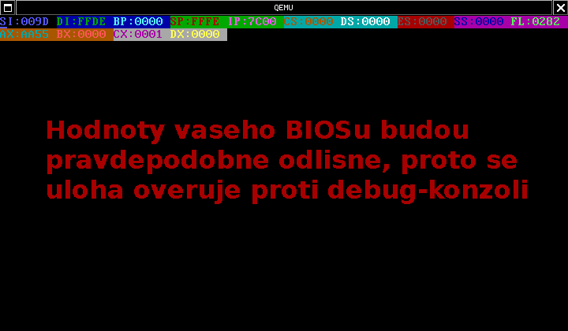
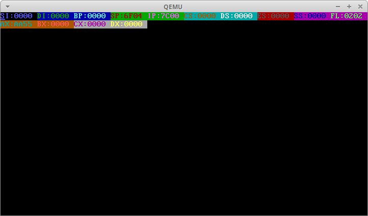

# BI-SOJ 2014/15

## Úloha 1.B

### Zadání

Za pouziti podprogramu A) napiste program pro bootsector, ktery na obrazovku za sebou barevne vypise inicialni hodnoty registru (hodnoty ve chvili, kdy predal BIOS vasemu programu rizeni). Pak se zastavi v nekonecne cekaci smycce.

**Vstup**:
Aktualni stav registru pri predani rizeni bootsectoru BIOSem.
**Vystup**:
Hexadecimalni vypis stavu registru pri predani rizeni bootsectoru BIOSem s barevne odlisenymi polozkami.
Testovaci screenshot:

Hodnoty jednotlivych polozek se mohou lisit podle verze BIOSu nebo hardwarove konfigurace pocitace. Uloha bude overovana v QEMU, kde byste meli dostat cisla, uvedena ve screenshotu. 

Poznamka: Vypisy z bootsectoru realizujeme zpravidla primym zapisem do videoram VGA adapteru. Nepsanym standardem je textovy rezim c. 3, 80x25 znaku, po jehoz inicializaci pomoci MOV AX,3; INT 10H je na adrese 0b800:0000h periodicky zobrazovano pole 4000 bajtu. Bajty tvori pary, kde prvni primo obsahuje ASCII hodnotu znaku, a nasledujici, vyssi bajt barevny atribut. Format atributu je defaultne [F,Rp,Gp,Bp,I,Ri,Gi,Bi], kde jednotlive bity primo urcuji zapnuti ci vypnuti RGB slozek podkladu a inkoustu. Bit I zvysuje intenzitu inkoustu, a bit F je v zavislosti na rozmarech VGA BIOSu bud blikani, nebo intenzita podkladu znaku. Barevne kombinace pro kazdy z registru v ukazce jsou binarne [00001001], [00010010], [00011011], [00100100], ... , [01111110]. Jak posloupnost vznikla, si jiste domyslite. Znaky jsou organizovany ve stejnem smyslu, v jakem cteme text. Tedy, prvni par je znak v levem hornim rohu, nasleduje dalsi znak napravo, a 80ty par je pak prvnim znakem dalsiho radku. Pokud nevite, jak zacit, podivejte se na ukazkovy zdrojovy text nasmsect.asm vyse.

K overeni vysledku muzete vyuzit drobneho triku - pripravte si bootsector, ktery se hned na prvnim bytu zastavi (pomoci instrukce skoku na sebe sama, takze 0EBh, 0FEh, ...., 055h, 0AAh). Pak z nej nabootujte, a prepnete Qemu do monitorove konzole (Ctrl+Alt+2 tam, Ctrl+Alt+1 zpet), a zde muzete pouzit jak prikaz "info registers", tak ostatni gdbovske konstrukty, jako p /x $eax, p /x $eflags nebo p /x $esi, zejmena pokud se informace z infa nevejde cela na obrazovku a nektery z registru vam utece (ale jde pouzit i Ctrl+PgUp a Ctrl+PgDn).

Druha cast ulohy je pro uplneho zacatecnika pomerne narocna, a proto ji budu hodnotit dostatecne benevolentne. Pro studenty, kteri jiz s assemblerem maji zkusenosti, naopak skryva nekolik zajimavych chytaku, takze dobre poslouzi jako lakmusovy papirek vasich dovednosti (ktere se v prubehu semestru obvykle vyrovnaji). Hotovou ulohu muzete predvest bud hned, nebo na pristim laboratornim cviceni (za 14 dnu). That's all. ;) Vzdy po uplynuti teto lhuty se dozvite, jak mela uloha vypadat. Komu se povede napsat kratsi kod, nez bude nas vzorovy (na byty), ziska vsestranne vyuzitelne plus. Pak mu mohou byt prominuty treba nepovedene testy, nebo ma sanci na lepsi znamku na konci semestru. 

### Řešení

