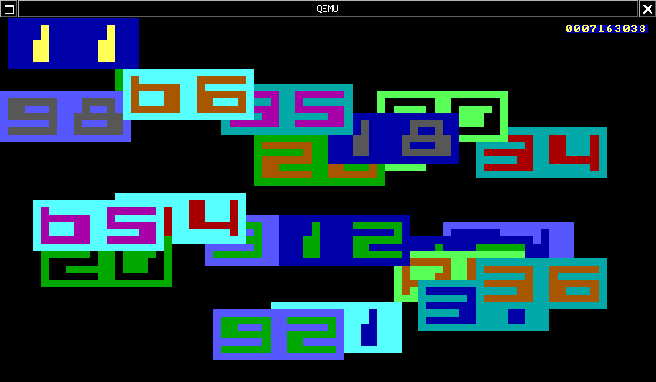
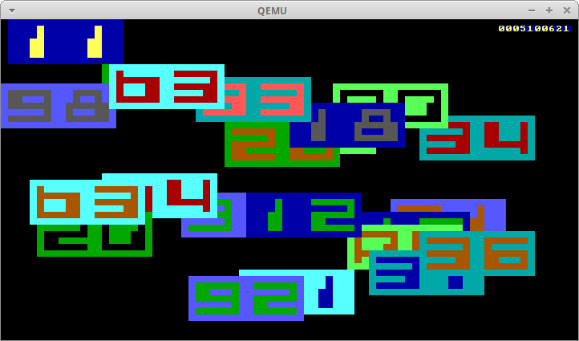

# BI-SOJ 2014/15

## Úloha 2

### Zadání

Pripravte si program, ktery bude umet nasledujici vec: 

**Vstup**:
Stisky klaves na klavesnici.

**Cinnost**:
Po nabootovani se nastavi textovy rezim 80x50 znaku a smaze obrazovka. V pravem hornim rohu obrazovky bezi desetimistny dekadicky citac, inicializovany na hodnotu 0000000000 a inkrementovany maximalni rychlosti. Stav je zobrazovan jasne zlutym inkoustem na tmavomodrem podkladu. Program zaroven nacita scancody AT klavesnice, ktere hexadecimalne zobrazuje na pozici urcene pseudonahodnym generatorem. Pro zobrazeni jsou vyuzity atributy textoveho rezimu, barva je odvozena od hodnoty scancode a vypis je realizovan fontem 6x5 pixelu, centrovanym do podkladoveho obdelniku 16x7 pixelu. Udaj citace musi byt vzdy viditelny a nesmi byt prekryt vypisem scancode.

**Testovaci screenshot**:

Na obrazku vidite vysledek po spusteni programu s postupnym stlacenim klaves 'w', 'e', 'l', 'l', '.', 'd', 'o', 'n', 'e', '?'. Stisky byly dostatecne kratke, aby se u zadneho scancode neuplatnilo automaticke opakovani stisku klavesy.

Poznamka: Textovy mod 80x50 znaku je urcitou modifikaci textoveho modu c. 3, kdy je do rastru 80x25 znaku vykreslovano fontem polovicni velikosti dvojnasobne mnozstvi znaku. Modifikaci modu c. 3 provadi sluzba VGA BIOSU, kterou zavolame pomoci MOV AX,1112H; INT 10H hned po jeho nastaveni. Pro barvu atributu i organizaci znaku plati totez, co pro mod c. 3, jen mame k dispozici 50 radku, a tedy celkem 4000 znaku reprezentovanych polem o rozmeru 8000 bajtu. Citac je desetimistny proto, aby se jeho hodnota nedala uchovavat ani ve 32 bitovem registru, a byli jste nuceni operaci pricitani nejakym zpusobem rozlozit na vice suboperaci. Citat lze bud primo v ASCII kodu, nebo hodnotu rozdelit do nekolika registru a prevadet na dekadicky tvar, nebo ukladat binarni reprezentaci namisto do registru do pole v pameti, moznosti je mnoho. Citac je umisten 1 radek od horniho okraje a 1 sloupec od praveho okraje, aby bylo videt, zda pri jeho preteceni nezapisujete nekam, kam nemate.

Scancode klavesnice je bytova hodnota, ktera je k mani na portu 60h v okamziku, kdy klavesnice hlasi preruseni IRQ1. Jindy platna byt nemusi, a tak budeme realizovat nacteni scancode i jeho zobrazeni v ramci obsluhy preruseni. Nejprve nastavime prislusny vektor (pro INT 9, kam je standardne radicem IRQ1 nasmerovano), kde je treba provest nastaveni vuci preruseni atomicky (protoze i8086 neumi atomicky zapsat vice nez 16 bitu, je treba docasne preruseni zakazat instrukci CLI a po vystaveni vektoru povolit STI). Obsluha preruseni muze mit na vstupu libovolne nastavene registry, a jedina hodnota, ktera je zarucena, je nastavene CS:IP podle naseho vektoru. Je tedy treba jak uschovat hodnoty vsech registru, ktere obsluha modifikuje, a pred skoncenim je obnovit, tak spravne nastavit segmentove registry (za vyuziti zname hodnoty CS). Obsluha MUSI nacist port 60h, a pred skoncenim odhlasit radici konec preruseni, zapisem 20H na port 20H. Teprve pak se muze vratit pomoci IRET do hlavniho programu, kde pokracuje zobrazovani beziciho citace.

Barva vypisu je urcena jednoduse - nacteny scancode je pomyslne chapan jako [Ip,Rp,Gp,Bp,Ii,Ri,Gi,Bi], a jeho nibbly tedy primo urcuji barvu podkladu a inkoustu. Protoze chceme zobrazovat intenzitu (kterou standardne VGA umi realizovat pouze pro pixely v barve inkoustu), je treba do videoram vlozit ASCII kod znaku, ktery ma vsechny pixely nastavene, a vykresleni fontu realizovat nastavovanim barvy inkoustu. Tento znak ma kod 0DBH. V pripade, ze jsou oba nibbly stejne, a znak by tedy nebyl videt (stejna barva inkoustu, jako papiru), nastavime hodnotu inkoustu jako bitovou negaci barvy podkladu (pro maximalni kontrast).

Pozice vypisu je urcena podle pseudonahodneho generatoru, realizujicim v sestnactibitove aritmetice rovnici N_new = M*N_old + A, pro M=33333 a A=1. N je inicializovano na 0H, a pri kazdem nacteni scancode se nejprve provede jedna iterace generatoru, a vysledek pak urcuje souradnice vypisu (levy horni roh je [0,0], pravy horni [79,0], levy dolni [49,0] a pravy dolni [49,79]). Souradnice X je urcena jako modulo (zbytek), N_new % 65, a souradnice Y jako (N_new / 65) % 44. Pokud se podivate na instrukci DIV, snadno zjistite, jak ji pro vypocet jednoduse pouzit.

Font je tvoren posloupnosti bitmap pro znaky '0', '1', ..., '9', 'A', ..., 'F', kde kazdy znak 6x5 pixelu zabira 5 bytu, a bity v kazdem bitu primo urcuji zda ma pixel barvu inkoustu (1) nebo podkladu (0). Pouzity font je k mani zde - ul2font.asm. Pokud se vam font nelibi, nadefinujte si vlastni, ale pouzijte stejny format (5 bytu na znak, celkem tedy 80 bytu na font). 

### Řešení

Odlišné scancodes jsou způsobeny nemotorností operátora :-)

